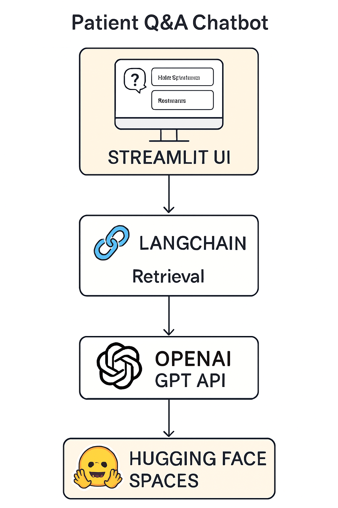
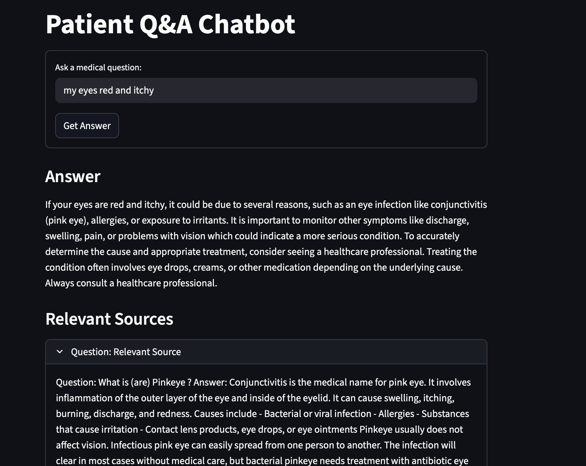
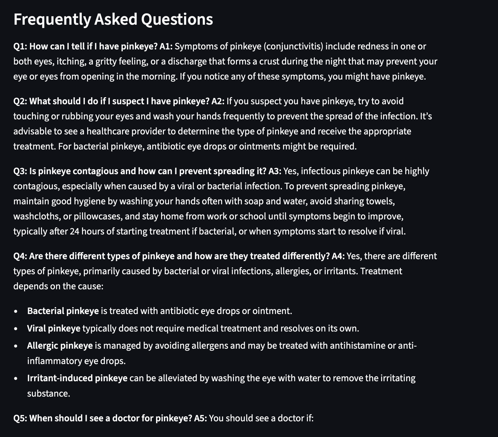
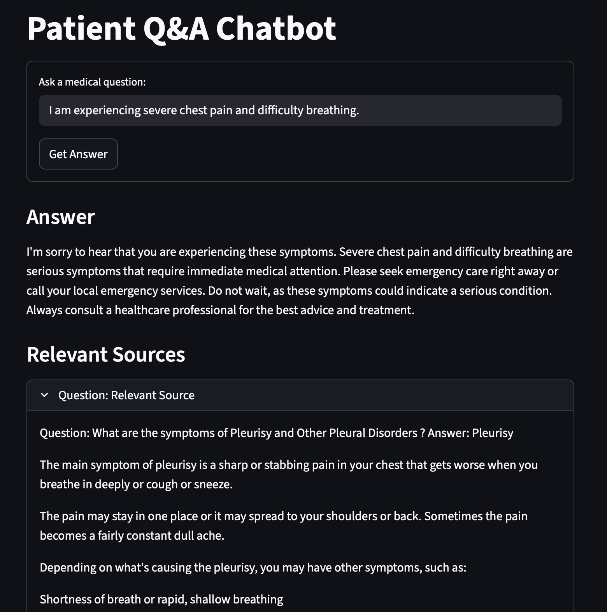
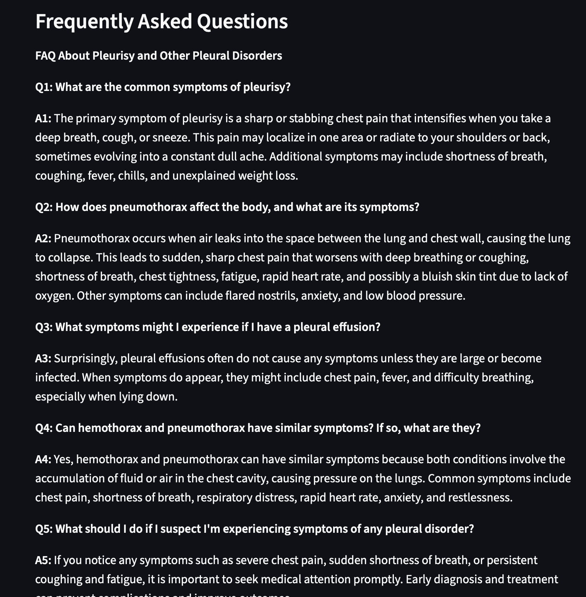

# Patient Q&A Chatbot

## Project Overview
This project is a medical Question & Answer chatbot designed to assist patients by providing accurate, safe, and context-aware answers to medical questions. It leverages a large, curated dataset of medical FAQs (MedQuAD) and combines advanced retrieval-augmented generation (RAG) using OpenAI language models to deliver reliable, source-cited responses. The chatbot prioritizes patient safety and aims to answer questions only within the bounds of trusted information.

## Architecture


## Tools Used
1. Python – Main programming language

2. Pandas – Data loading and cleaning

3. LangChain – RAG logic and pipeline construction

4. ChromaDB – Vector database for semantic retrieval

5. OpenAI API – Language models for advanced Q&A

6. Streamlit – User interface for patient interaction

7. MedQuAD Dataset – Curated medical Q&A source

8. python-dotenv – Environment variable management

9. Git & GitHub – Version control

10. Hugging face spaces - For deployment

## Project Live Link - https://huggingface.co/spaces/tanmair98/patientqnachatbot

## Demo

Try these sample questions once the app is running:

- What are the early symptoms of diabetes?

- How is hypertension diagnosed?

- Can I take ibuprofen with acetaminophen?

- When should I see a doctor for chest pain?

## Key Features

- Retrieval-Augmented Generation (RAG) with citation-backed answers

- “Relevant Sources” panel with de-duplicated Q&A references

- Safety guardrails:

- Urgent escalation detection for emergencies

- Sensitive topic handling and disclaimers

- Redaction of sensitive personal information in prompts

- Clean Streamlit UI for quick demos and testing

## Run Locally

Prerequisites:

Python 3.10+

OpenAI API key

Steps:

1. Install dependencies

```
pip install -r requirements.txt
```

2. Set your environment variable (or use a .env if your code loads it)
    - macOS/Linux:
    ```
    export OPENAI_API_KEY="your_key_here"
    ```
    - Windows (PowerShell):
    ```
    setx OPENAI_API_KEY "your_key_here"
    ```

3. Start the app

```
streamlit run ui/app.py
```

## Deploy on Hugginf Face Spaces

If using the Streamlit SDK Space:

- Ensure these files/folders exist in the repo:

    - ui/app.py

    - chains/, retrieval/, utils/ (code modules)

    - requirements.txt

    - architecture.png (optional)

- Add your OpenAI key under Settings → Secrets as:

- Push changes to trigger an automatic build.

If using a Docker Space, your Dockerfile entry point should look like:

```
FROM python:3.10-slim
WORKDIR /app
COPY requirements.txt .
RUN pip install --no-cache-dir -r requirements.txt
COPY . .
EXPOSE 7860
CMD ["streamlit","run","ui/app.py","--server.port","7860","--server.address","0.0.0.0"]
```

## RESULTS




