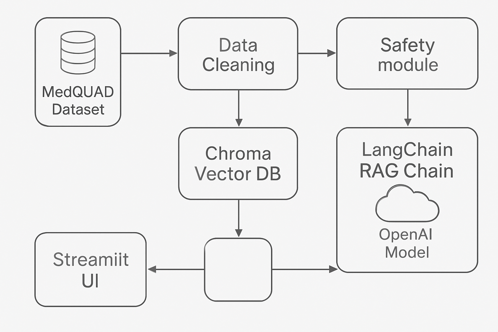

# Patient Q&A Chatbot

## Project Overview
This project is a medical Question & Answer chatbot designed to assist patients by providing accurate, safe, and context-aware answers to medical questions. It leverages a large, curated dataset of medical FAQs (MedQuAD) and combines advanced retrieval-augmented generation (RAG) using OpenAI language models to deliver reliable, source-cited responses. The chatbot prioritizes patient safety and aims to answer questions only within the bounds of trusted information.

## Architecture

## Tools Used
1. Python – Main programming language

2. Pandas – Data loading and cleaning

3. LangChain – RAG logic and pipeline construction

4. ChromaDB – Vector database for semantic retrieval

5. OpenAI API – Language models for advanced Q&A

6. Streamlit – User interface for patient interaction

7. MedQuAD Dataset – Curated medical Q&A source

8. python-dotenv – Environment variable management

9. Git & GitHub – Version control

## Results
